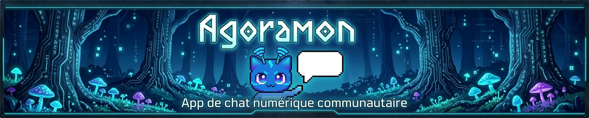

# 👋 Hi, I'm Mathias

💻 Backend / DevOps oriented developer  
🧠 Interested in **systems architecture, infrastructure and scalable backend services**

---

# 🚀 Current Project — Agoramon

**Agoramon** is a community platform inspired by **Discord, YouTube and Twitch**.

The goal is to build a modern communication platform combining:

- 💬 Real-time messaging
- 🎤 Voice channels
- 🎥 Video content
- 📡 Future live streaming

The project focuses heavily on **backend architecture, infrastructure and scalability**.

### Main features

- Real-time chat using **WebSocket**
- Voice communication using **WebRTC**
- Media uploads (images / videos / files)
- Distributed ID generation (Snowflake)
- Media processing (thumbnails, compression, encoding)

### Core architecture

Frontend
- Vue.js 3
- Vite
- Pinia
- Axios
- Electron desktop client

Backend
- Java
- Spring Boot
- Spring Security
- Spring WebSocket
- Hibernate / JPA

Infrastructure
- Docker containers
- Traefik reverse proxy
- Redis caching
- MariaDB database
- MinIO object storage

Monitoring
- Prometheus
- Grafana
- Loki

The project is designed with a strong focus on **scalability, infrastructure automation and distributed systems**.

---

# 🧩 Previous Project (NDA)

Worked on a **large-scale multiplayer game infrastructure project** involving:

- custom **game server architecture**
- **reverse engineering** of legacy network protocols
- **AI systems using Behaviour Trees**
- **game launcher and patching system**
- **backend services and account management**
- **network optimization and packet handling**

Due to **NDA restrictions**, the project name and code cannot be publicly shared.

---

# 🧠 Technical Stack

## 💻 Languages

---

## 🏗 Backend / Frameworks

---

## 🐳 DevOps & Infrastructure

---

## 🖥 Systems

---

## 🗄 Databases

---

# 🎯 Focus

- Backend architecture
- Infrastructure & DevOps
- Scalable systems
- Distributed services
- Automation & deployment